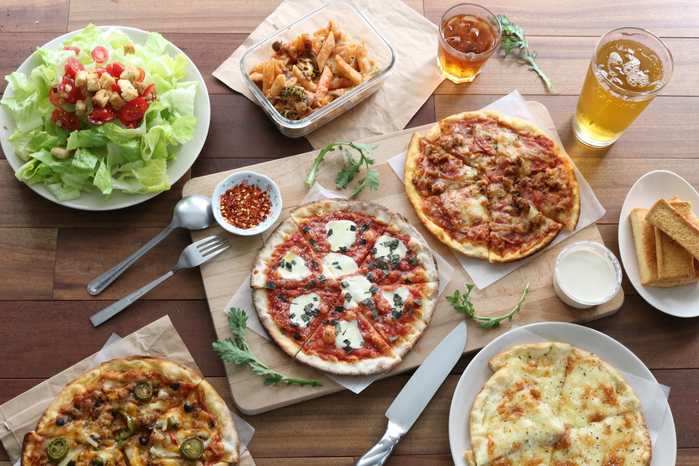
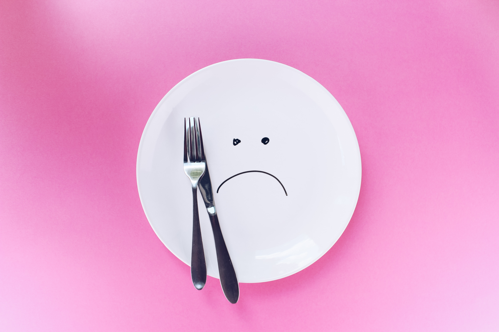

<!DOCTYPE html>
<html lang="en">

<head>
    <meta charset="UTF-8">
    <meta http-equiv="X-UA-Compatible" content="IE=edge">
    <meta name="viewport" content="width=device-width, initial-scale=1.0">
    <title>best delivery food service in india|myonlinemeal.com</title>
    <link rel="stylesheet" href="style3.css">
    <link rel="stylesheet" media="screen and (max-width:1310px)" href="phone.css">
    <link rel="preconnect" href="https://fonts. googleapis.com">
    <!-- <link rel="stylesheet" href="https://cdn.jsdelivr.net/npm/bootstrap@4.4.1/dist/css/bootstrap.min.css" .. </head> -->
      
<body>
    <nav id="navbar">
        

            
        

        <ul>
            <li class="item"><a href="#home">Home</a></li>
            <li class="item"><a href="#services-container">Sevices</a></li>
            <li class="item"><a href="#clients">Our Clients</a></li>
            <li class="item"><a href="#contact">Contact Us</a></li>
            <li class="item"><a href="#">Email Me</a></li>
        </ul>
    </nav>
    
    <section id="home">
        
        <h1 class="h-primary">Welcome to MyOnlineMeal</h1>
        
Lorem ipsum dolor sit amet, consectetur adipisicing elit. Aspernatur praesentium eos quia cum adipisci
            repellendus assumenda accusantium, veniam animi suscipit minima velit debitis, explicabo nemo.

        

            Lorem ipsum dolor sit amet consectetur adipisicing elit. Hic aspernatur obcaecati voluptas nobis non. Vero
            facilis voluptates expedita rem cumque totam quia sunt iure blanditiis?
        

        <buttton class="btn">Order Now</buttton>
        

    </section>
    <section id="services-container">
        <h1 class="h-primarycenter">Our Services</h1>
        

            

                
                <h2 class="h-secondary_center">Food Ordering</h2>
                
Lorem ipsum dolor sit amet consectetur adipisicing elit. Est doloribus, tenetur architecto a quae
                    expedita sunt eveniet repellat tempora magni autem. Consectetur unde labore in!

            

            

                
                <h2 class="h-secondary_center">Food Catering</h2>
                
Lorem ipsum dolor sit amet consectetur adipisicing elit. Est doloribus, tenetur architecto a quae
                    expedita sunt eveniet repellat tempora magni autem. Consectetur unde labore in!

            

            

                
                <h2 class="h-secondary_center">Bulk Ordering</h2>
                
Lorem ipsum dolor sit amet consectetur adipisicing elit. Est doloribus, tenetur architecto a quae
                    expedita sunt eveniet repellat tempora magni autem. Consectetur unde labore in!

            

        

    </section>
        <section id="client-section">
        <h1 class="h-primarycenter">Our Clients</h1>
        

            

                
            

            

                
            

            

                
            

        

        </section>
    <section id="contact">
        <h1 class="h-primarycenter">Contact Us</h1>
        

            <form action=" ">
                

                    <label for="name">Name:</label>
                    <input type="text" name="name" id="name" placeholder="enter your name">  
                

                

                    <label for="Email Me">Email:</label>
                    <input type="email" name="Email" id="name" placeholder="enter your email">
                

                

                    <label for="Phone">Phone:</label>
                    <input type="number" name="Phone" id="name" placeholder="enter your phone number">
                

                

                    <label for="Message">Message:</label>
                    <textarea name="Message" id="" cols="30" rows="10"></textarea>
                    <input type="submit" , placeholder="Submit Now"width="1px" , height="1px">  
                

            </form>
            
        

    </section>
    <footer>
        

            copyright &copy; www.myonlinemeal.com. All rights reserved !

        

    </footer>

</body>

</html><html lang="en">

<head>
    <meta charset="UTF-8">
    <meta http-equiv="X-UA-Compatible" content="IE=edge">
    <meta name="viewport" content="width=device-width, initial-scale=1.0">
    <title>best delivery food service in india|myonlinemeal.com</title>
    <link rel="stylesheet" href="style3.css">
    <link rel="stylesheet" media="screen and (max-width:1310px)" href="phone.css">
    <link rel="preconnect" href="https://fonts. googleapis.com">
    <!-- <link rel="stylesheet" href="https://cdn.jsdelivr.net/npm/bootstrap@4.4.1/dist/css/bootstrap.min.css" .. </head> -->
      
<body>
    <nav id="navbar">
        

            
        

        <ul>
            <li class="item"><a href="#home">Home</a></li>
            <li class="item"><a href="#services-container">Sevices</a></li>
            <li class="item"><a href="#clients">Our Clients</a></li>
            <li class="item"><a href="#contact">Contact Us</a></li>
            <li class="item"><a href="#">Email Me</a></li>
        </ul>
    </nav>
    
    <section id="home">
        
        <h1 class="h-primary">Welcome to MyOnlineMeal</h1>
        
Lorem ipsum dolor sit amet, consectetur adipisicing elit. Aspernatur praesentium eos quia cum adipisci
            repellendus assumenda accusantium, veniam animi suscipit minima velit debitis, explicabo nemo.

        

            Lorem ipsum dolor sit amet consectetur adipisicing elit. Hic aspernatur obcaecati voluptas nobis non. Vero
            facilis voluptates expedita rem cumque totam quia sunt iure blanditiis?
        

        <buttton class="btn">Order Now</buttton>
        

    </section>
    <section id="services-container">
        <h1 class="h-primarycenter">Our Services</h1>
        

            

                
                <h2 class="h-secondary_center">Food Ordering</h2>
                
Lorem ipsum dolor sit amet consectetur adipisicing elit. Est doloribus, tenetur architecto a quae
                    expedita sunt eveniet repellat tempora magni autem. Consectetur unde labore in!

            

            

                
                <h2 class="h-secondary_center">Food Catering</h2>
                
Lorem ipsum dolor sit amet consectetur adipisicing elit. Est doloribus, tenetur architecto a quae
                    expedita sunt eveniet repellat tempora magni autem. Consectetur unde labore in!

            

            

                
                <h2 class="h-secondary_center">Bulk Ordering</h2>
                
Lorem ipsum dolor sit amet consectetur adipisicing elit. Est doloribus, tenetur architecto a quae
                    expedita sunt eveniet repellat tempora magni autem. Consectetur unde labore in!

            

        

    </section>
        <section id="client-section">
        <h1 class="h-primarycenter">Our Clients</h1>
        

            

                
            

            

                
            

            

                
            

        

        </section>
    <section id="contact">
        <h1 class="h-primarycenter">Contact Us</h1>
        

            <form action=" ">
                

                    <label for="name">Name:</label>
                    <input type="text" name="name" id="name" placeholder="enter your name">  
                

                

                    <label for="Email Me">Email:</label>
                    <input type="email" name="Email" id="name" placeholder="enter your email">
                

                

                    <label for="Phone">Phone:</label>
                    <input type="number" name="Phone" id="name" placeholder="enter your phone number">
                

                

                    <label for="Message">Message:</label>
                    <textarea name="Message" id="" cols="30" rows="10"></textarea>
                    <input type="submit" , placeholder="Submit Now"width="1px" , height="1px">  
                

            </form>
            
        

    </section>
    <footer>
        

            copyright &copy; www.myonlinemeal.com. All rights reserved !

        

    </footer>

</body>

</html>
